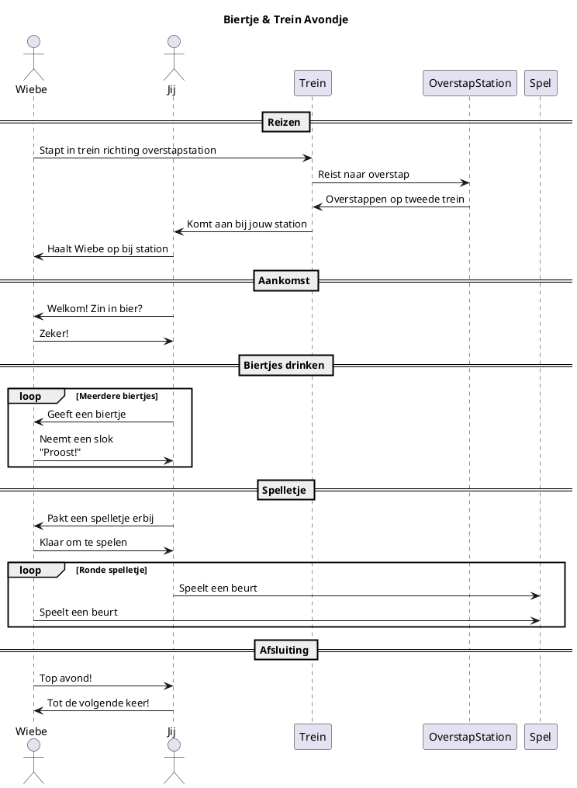

# sexybuurvrouw



```plantuml
@startuml
actor Wiebe
actor Jij as Jij

title Biertje & Trein Avondje

== Reizen ==
Wiebe -> Trein: Stapt in trein richting overstapstation
Trein -> OverstapStation: Reist naar overstap
OverstapStation -> Trein: Overstappen op tweede trein
Trein -> Jij: Komt aan bij jouw station
Jij -> Wiebe: Haalt Wiebe op bij station

== Aankomst ==
Jij -> Wiebe: Welkom! Zin in bier?
Wiebe -> Jij: Zeker!

== Biertjes drinken ==
loop Meerdere biertjes
    Jij -> Wiebe: Geeft een biertje
    Wiebe -> Jij: Neemt een slok\n"Proost!"
end

== Spelletje ==
Jij -> Wiebe: Pakt een spelletje erbij
Wiebe -> Jij: Klaar om te spelen
loop Ronde spelletje
    Jij -> Spel: Speelt een beurt
    Wiebe -> Spel: Speelt een beurt
end

== Afsluiting ==
Wiebe -> Jij: Top avond!
Jij -> Wiebe: Tot de volgende keer!

@enduml
```

```cpp
int a =0;
```
